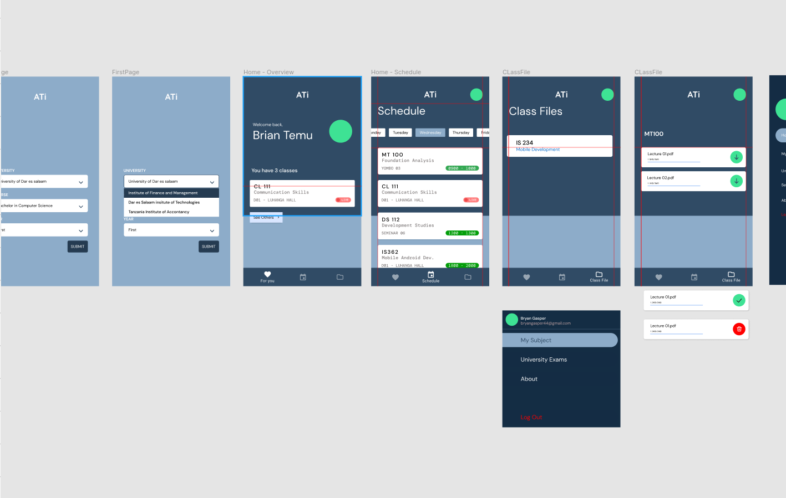
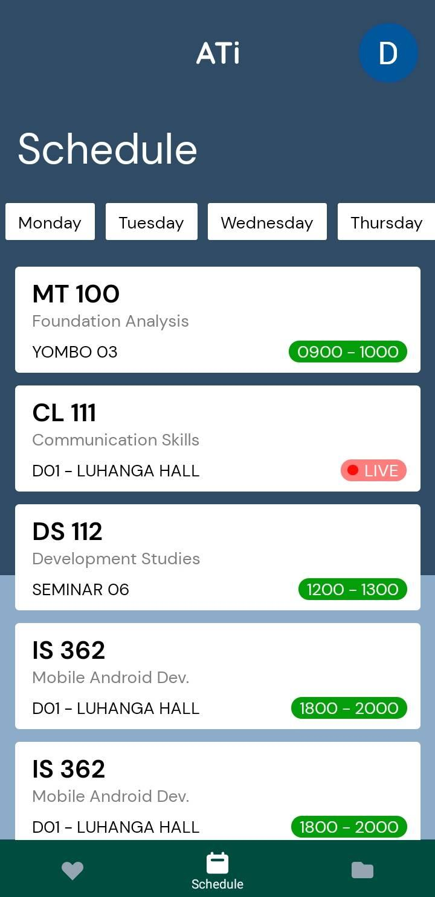

# Overview
### A platform create in react-native framework where students get the timetable of the semester plus the updates of the class resources (class file). 
### On the user(Students) end is an application on the other end that the university can prepare the timetable and also can publish the timetable according to the respective course.

## The Design Link : https://www.figma.com/file/mJGxFz1OQQokGS1T1yNk5K/ATi?node-id=0%3A1

